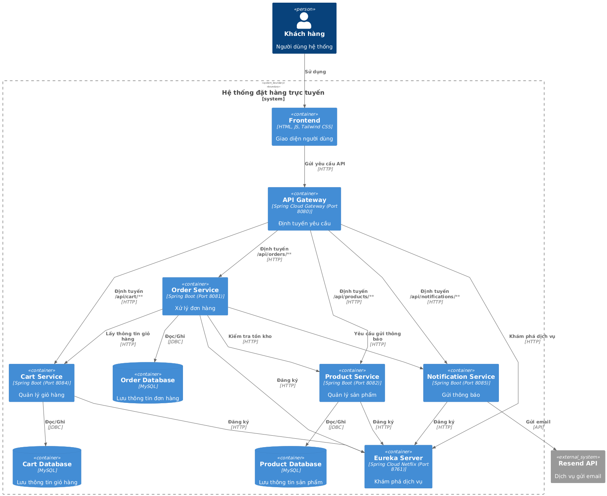
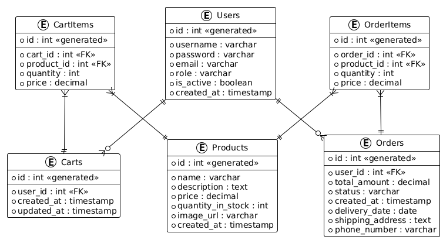

# Kiến trúc Hệ thống

## Tổng quan
Hệ thống đặt hàng trực tuyến là một nền tảng microservices cho phép người dùng xem sản phẩm, thêm vào giỏ hàng, đặt hàng và nhận thông báo xác nhận. Hệ thống được thiết kế theo kiến trúc microservices để đảm bảo tính mô-đun, khả năng mở rộng và khả năng chịu lỗi.

Các thành phần chính của hệ thống bao gồm dịch vụ người dùng, dịch vụ sản phẩm, dịch vụ giỏ hàng, dịch vụ đơn hàng, dịch vụ thông báo, máy chủ Eureka và API Gateway, tất cả đều phối hợp để cung cấp trải nghiệm người dùng liền mạch.

## Các thành phần hệ thống

### User Service
Quản lý thông tin người dùng, xác thực và phân quyền. Dịch vụ này lưu trữ dữ liệu người dùng, xử lý đăng nhập và cung cấp thông tin về quyền truy cập cho các dịch vụ khác.

### Product Service
Quản lý danh mục sản phẩm và tồn kho. Dịch vụ này cho phép truy vấn thông tin sản phẩm, kiểm tra tồn kho và cập nhật số lượng sản phẩm khi đơn hàng được tạo.

### Cart Service
Quản lý giỏ hàng của người dùng. Dịch vụ này cho phép thêm, cập nhật hoặc xóa sản phẩm khỏi giỏ hàng của người dùng và lưu trữ trạng thái giỏ hàng.

### Order Service
Xử lý việc tạo và quản lý đơn hàng. Dịch vụ này tích hợp với các dịch vụ khác để xác thực người dùng, kiểm tra tồn kho và gửi thông báo khi đơn hàng được tạo.

### Notification Service
Gửi thông báo qua email cho người dùng khi đơn hàng được tạo. Dịch vụ này sử dụng Resend API để gửi email.

### Eureka Server
Cung cấp khám phá dịch vụ và đăng ký dịch vụ. Tất cả các microservices đăng ký với Eureka Server, cho phép chúng khám phá và giao tiếp với nhau.

### API Gateway
Đóng vai trò là điểm vào duy nhất cho các yêu cầu từ người dùng. API Gateway định tuyến yêu cầu đến các dịch vụ tương ứng và cung cấp các tính năng như bảo mật, cân bằng tải và giám sát.

## Giao tiếp

Các dịch vụ trong hệ thống giao tiếp thông qua REST API. API Gateway định tuyến các yêu cầu từ người dùng đến các dịch vụ cụ thể dựa trên các mẫu URL.

Bên trong hệ thống, các dịch vụ khám phá nhau thông qua Eureka Server và giao tiếp trực tiếp khi cần. Ví dụ, khi một đơn hàng được tạo, Order Service giao tiếp với Product Service để kiểm tra tồn kho, với User Service để xác thực người dùng và với Notification Service để gửi email xác nhận.

Trong môi trường Docker Compose, các dịch vụ có thể tham chiếu đến nhau bằng tên dịch vụ (ví dụ: `http://order-service:8082`) thay vì địa chỉ IP.

## Luồng dữ liệu

1. **Luồng đặt hàng**:
   - Người dùng xác thực thông qua User Service
   - Người dùng duyệt sản phẩm từ Product Service
   - Người dùng thêm sản phẩm vào giỏ hàng, được lưu trong Cart Service
   - Khi đặt hàng, Order Service kiểm tra với Product Service về tồn kho
   - Nếu tồn kho đủ, Order Service tạo đơn hàng và cập nhật tồn kho trong Product Service
   - Order Service yêu cầu Notification Service gửi email xác nhận

2. **Phụ thuộc bên ngoài**:
   - MySQL: Mỗi dịch vụ có cơ sở dữ liệu riêng
   - Resend API: Được sử dụng bởi Notification Service để gửi email

## Sơ đồ

Hình minh họa kiến trúc hệ thống được lưu tại `docs/asset/Architechture.png`:

Hình minh họa Cơ sở dữ liệu hệ thống được lưu tại `docs/asset/CSDL.png`:

## Khả năng mở rộng & Chịu lỗi

### Khả năng mở rộng
- Các dịch vụ có thể được mở rộng độc lập dựa trên nhu cầu
- Nhiều phiên bản của cùng một dịch vụ có thể được đăng ký với Eureka Server
- API Gateway có thể cân bằng tải giữa các phiên bản của cùng một dịch vụ

### Chịu lỗi
- Eureka Server cung cấp khả năng phát hiện lỗi dịch vụ
- Nếu một dịch vụ không khả dụng, các dịch vụ khác có thể tiếp tục hoạt động với chức năng bị giới hạn
- Các cơ chế thử lại và ngắt mạch có thể được triển khai để cải thiện khả năng chịu lỗi

Kiến trúc microservices này đảm bảo rằng hệ thống có thể mở rộng để xử lý tải cao hơn và chịu được sự cố trong các dịch vụ riêng lẻ mà không ảnh hưởng đến toàn bộ hệ thống. 